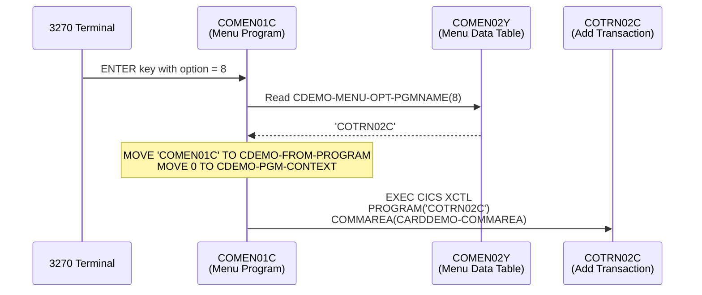
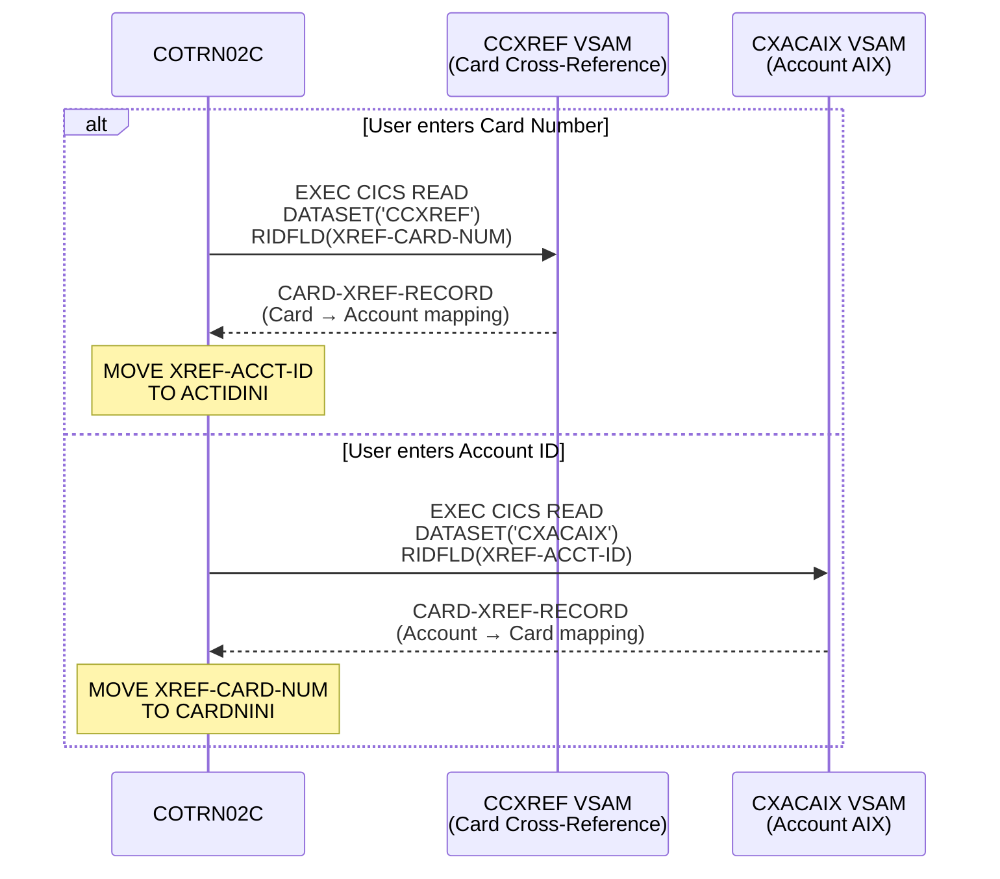
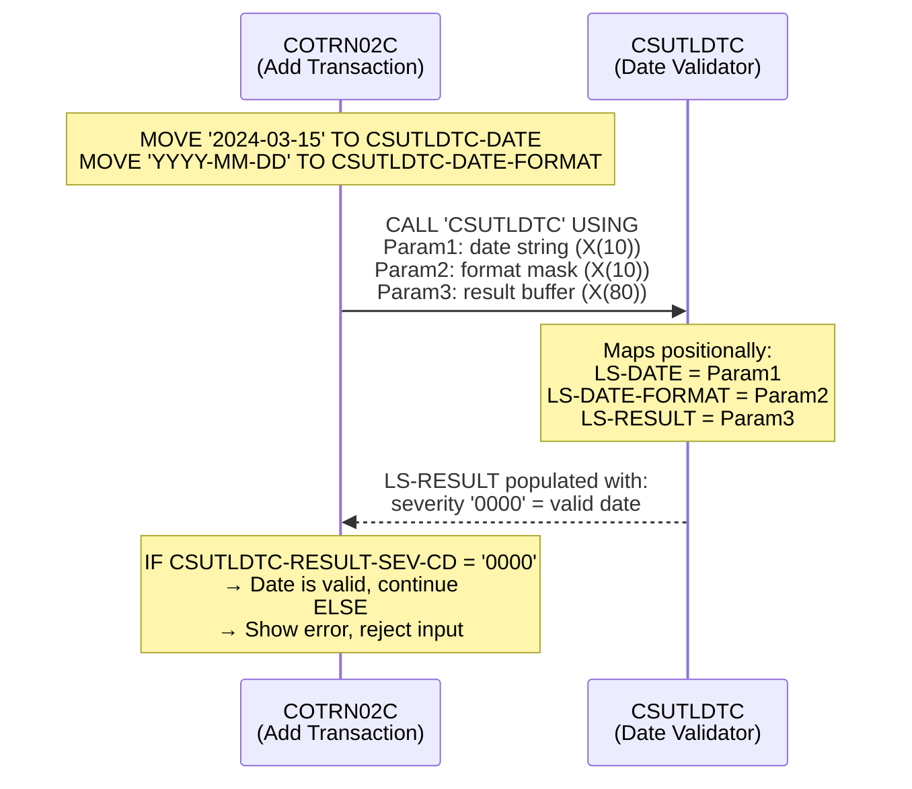
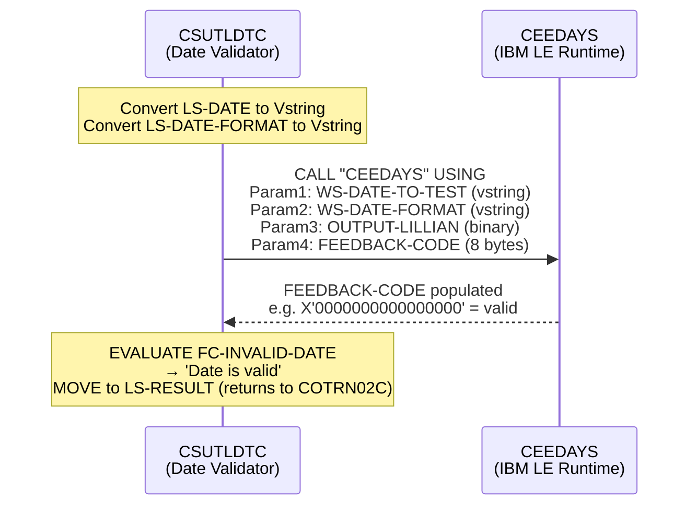
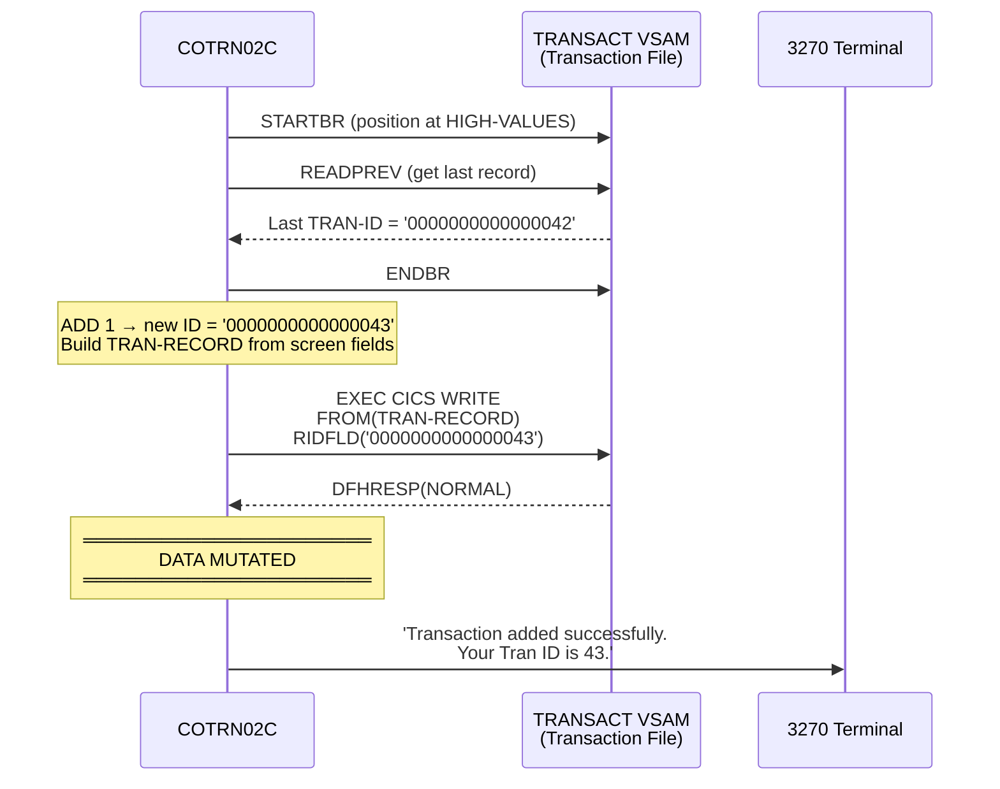
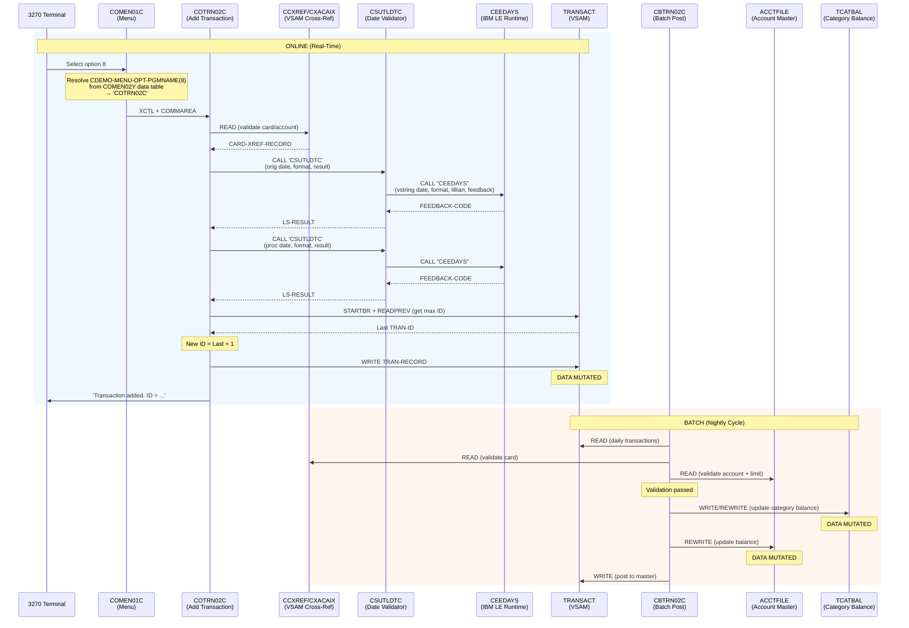
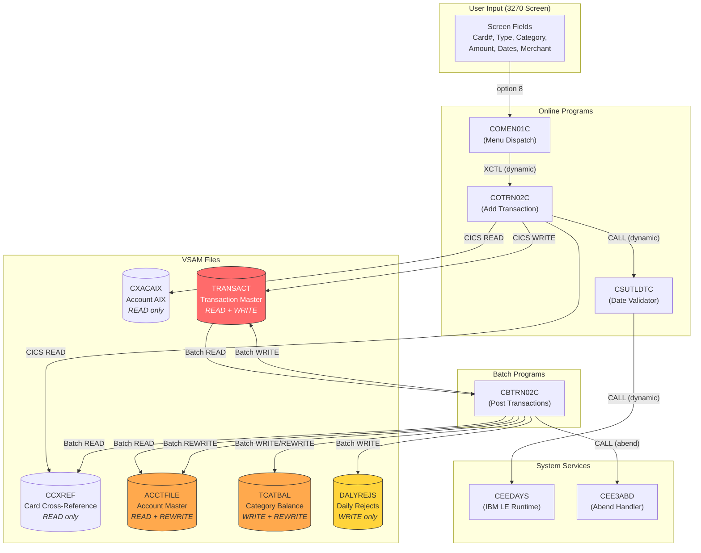

# Dynamic Call Resolution: Add Transaction Flow

> **Generated by Devin** — This document was produced by semantically reading through
> the CardDemo COBOL source code, resolving dynamic calls, tracing parameter linkage
> across program boundaries, and mapping data mutations across VSAM files.
>
> No static grep or text search can produce this analysis. Every call target, parameter
> mapping, and data flow was resolved by reading the code the way the CICS runtime would
> execute it.

---

## Table of Contents

1. [Overview](#overview)
2. [Step 1: Menu Dispatch — Resolving the Dynamic XCTL](#step-1-menu-dispatch--resolving-the-dynamic-xctl)
3. [Step 2: Entering COTRN02C — The Add Transaction Program](#step-2-entering-cotrn02c--the-add-transaction-program)
4. [Step 3: Cross-Reference Lookup — Resolving Card/Account Identity](#step-3-cross-reference-lookup--resolving-cardaccount-identity)
5. [Step 4: Dynamic CALL to CSUTLDTC — Date Validation](#step-4-dynamic-call-to-csutldtc--date-validation)
6. [Step 5: Chained CALL to CEEDAYS — IBM LE Runtime](#step-5-chained-call-to-ceedays--ibm-le-runtime)
7. [Step 6: Writing the Transaction — Data Mutation](#step-6-writing-the-transaction--data-mutation)
8. [Step 7: Downstream Batch Processing — CBTRN02C](#step-7-downstream-batch-processing--cbtrn02c)
9. [Complete Call Flow Diagram](#complete-call-flow-diagram)
10. [Data Lineage Diagram](#data-lineage-diagram)
11. [Dynamic Call Resolution Summary](#dynamic-call-resolution-summary)
12. [Shared Data Structures (Copybooks)](#shared-data-structures-copybooks)

---

## Overview

When a user selects **"Add Transaction"** (menu option 8) on the CardDemo 3270 terminal,
the system executes a chain of dynamically-resolved program calls that span:

- **CICS XCTL** transfers (program name resolved from a data table at runtime)
- **COBOL CALL** statements (subroutine resolved by the OS loader at runtime)
- **CICS File I/O** (dataset names resolved via the CICS File Control Table at runtime)
- **Batch processing** (deferred data mutations on the same VSAM files)

None of these targets are statically linked. A grep for `COTRN02C` in the calling
program finds **nothing** — the program name lives in a data table that must be read
and interpreted semantically.

---

## Step 1: Menu Dispatch — Resolving the Dynamic XCTL

### What Devin Reads

**File: `app/cbl/COMEN01C.cbl`** — Main Menu program

The menu program receives user input (option number) and transfers control to the
corresponding program. The critical code at lines 184-187:

```cobol
EXEC CICS
    XCTL PROGRAM(CDEMO-MENU-OPT-PGMNAME(WS-OPTION))
    COMMAREA(CARDDEMO-COMMAREA)
END-EXEC
```

The target program name is **not a literal** — it is `CDEMO-MENU-OPT-PGMNAME(WS-OPTION)`,
a variable indexed into a table. To resolve it, Devin must read the data table.

### How Devin Resolves It

**File: `app/cpy/COMEN02Y.cpy`** — Menu Options Data Table

```cobol
05 CDEMO-MENU-OPTIONS-DATA.
    *  ... options 1-7 ...
    10 FILLER    PIC 9(02) VALUE 8.
    10 FILLER    PIC X(35) VALUE
        'Transaction Add                    '.
    10 FILLER    PIC X(08) VALUE 'COTRN02C'.    <-- RESOLVED!
    10 FILLER    PIC X(01) VALUE 'U'.
```

The table is overlaid with a `REDEFINES` at line 93:

```cobol
05 CDEMO-MENU-OPTIONS REDEFINES CDEMO-MENU-OPTIONS-DATA.
    10 CDEMO-MENU-OPT OCCURS 12 TIMES.
        15 CDEMO-MENU-OPT-NUM       PIC 9(02).
        15 CDEMO-MENU-OPT-NAME      PIC X(35).
        15 CDEMO-MENU-OPT-PGMNAME   PIC X(08).    <-- This is the variable
        15 CDEMO-MENU-OPT-USRTYPE   PIC X(01).
```

### Resolution Result

| Input | Variable | Resolved Value | Mechanism |
|-------|----------|---------------|-----------|
| User types `8` | `CDEMO-MENU-OPT-PGMNAME(8)` | `'COTRN02C'` | REDEFINES overlay on FILLER data table |

### State Passed via COMMAREA

The menu program passes `CARDDEMO-COMMAREA` (defined in `COCOM01Y.cpy`) to the target:

```cobol
01 CARDDEMO-COMMAREA.
   05 CDEMO-GENERAL-INFO.
      10 CDEMO-FROM-TRANID      PIC X(04).   -- 'CM00' (menu tran ID)
      10 CDEMO-FROM-PROGRAM     PIC X(08).   -- 'COMEN01C'
      10 CDEMO-TO-TRANID        PIC X(04).
      10 CDEMO-TO-PROGRAM       PIC X(08).   -- 'COTRN02C'
      10 CDEMO-USER-ID          PIC X(08).
      10 CDEMO-USER-TYPE        PIC X(01).   -- 'U' (user) or 'A' (admin)
      10 CDEMO-PGM-CONTEXT      PIC 9(01).   -- 0 (first entry)
   05 CDEMO-CUSTOMER-INFO.
      10 CDEMO-CUST-ID          PIC 9(09).
      ...
   05 CDEMO-ACCOUNT-INFO.
      10 CDEMO-ACCT-ID          PIC 9(11).
      ...
```

> **Key Insight:** The COMMAREA is the "thread context" of CICS — it carries state
> across XCTL boundaries. Without reading `COCOM01Y.cpy`, you cannot understand what
> data flows between programs.



---

## Step 2: Entering COTRN02C — The Add Transaction Program

### What Devin Reads

**File: `app/cbl/COTRN02C.cbl`** — Add Transaction program (784 lines)

On first entry (`CDEMO-PGM-CONTEXT = 0`), the program:

1. Sets `CDEMO-PGM-REENTER` to TRUE (so next interaction knows it's a re-entry)
2. Sends the Add Transaction BMS screen (`COTRN2A` map)
3. Returns to CICS with `TRANSID('CT02')` — awaiting user input

On re-entry (user has filled in the form and pressed ENTER):

```cobol
PERFORM RECEIVE-TRNADD-SCREEN
EVALUATE EIBAID
    WHEN DFHENTER
        PERFORM PROCESS-ENTER-KEY        <-- Main processing path
    WHEN DFHPF3
        PERFORM RETURN-TO-PREV-SCREEN    <-- Back to menu
    WHEN DFHPF4
        PERFORM CLEAR-CURRENT-SCREEN     <-- Clear form
    WHEN DFHPF5
        PERFORM COPY-LAST-TRAN-DATA      <-- Copy previous transaction
END-EVALUATE
```

`PROCESS-ENTER-KEY` triggers three major operations:

```cobol
PERFORM VALIDATE-INPUT-KEY-FIELDS    -- Step 3: XREF lookup
PERFORM VALIDATE-INPUT-DATA-FIELDS   -- Step 4: Date validation (dynamic CALL)
...
PERFORM ADD-TRANSACTION              -- Step 6: VSAM WRITE
```

---

## Step 3: Cross-Reference Lookup — Resolving Card/Account Identity

### What Devin Reads

The program needs to validate that the Card Number or Account ID exists. It uses
**two VSAM files** with variable dataset names:

```cobol
05 WS-CCXREF-FILE    PIC X(08) VALUE 'CCXREF  '.
05 WS-CXACAIX-FILE   PIC X(08) VALUE 'CXACAIX '.
```

**Path A — User enters Account ID:**

```cobol
MOVE WS-ACCT-ID-N TO XREF-ACCT-ID
PERFORM READ-CXACAIX-FILE               <-- Reads CXACAIX by Account ID
MOVE XREF-CARD-NUM TO CARDNINI          <-- Populates Card Number
```

**Path B — User enters Card Number:**

```cobol
MOVE WS-CARD-NUM-N TO XREF-CARD-NUM
PERFORM READ-CCXREF-FILE                <-- Reads CCXREF by Card Number
MOVE XREF-ACCT-ID TO ACTIDINI           <-- Populates Account ID
```

### Data Structure Resolved

**File: `app/cpy/CVACT03Y.cpy`** — Cross-reference record layout:

```cobol
01 CARD-XREF-RECORD.                          (Record Length: 50 bytes)
    05  XREF-CARD-NUM       PIC X(16).        -- Credit card number
    05  XREF-CUST-ID        PIC 9(09).        -- Customer ID
    05  XREF-ACCT-ID        PIC 9(11).        -- Account ID
    05  FILLER              PIC X(14).
```

### File I/O Resolution

| Variable | Value | Physical Resolution | Key Field |
|----------|-------|-------------------|-----------|
| `WS-CCXREF-FILE` | `'CCXREF  '` | CICS FCT → VSAM KSDS | `XREF-CARD-NUM` (16 bytes) |
| `WS-CXACAIX-FILE` | `'CXACAIX '` | CICS FCT → VSAM AIX | `XREF-ACCT-ID` (11 bytes) |



---

## Step 4: Dynamic CALL to CSUTLDTC — Date Validation

### What Devin Reads

**File: `app/cbl/COTRN02C.cbl`** lines 389-427 — Two date validation calls:

```cobol
*--- Validate Origination Date ---
MOVE TORIGDTI OF COTRN2AI TO CSUTLDTC-DATE
MOVE WS-DATE-FORMAT       TO CSUTLDTC-DATE-FORMAT
MOVE SPACES               TO CSUTLDTC-RESULT

CALL 'CSUTLDTC' USING   CSUTLDTC-DATE
                         CSUTLDTC-DATE-FORMAT
                         CSUTLDTC-RESULT

*--- Validate Processing Date ---
MOVE TPROCDTI OF COTRN2AI TO CSUTLDTC-DATE
CALL 'CSUTLDTC' USING   CSUTLDTC-DATE
                         CSUTLDTC-DATE-FORMAT
                         CSUTLDTC-RESULT
```

This is a **dynamic CALL** — the OS loader resolves `'CSUTLDTC'` from the load library
at runtime. The parameters are **positional** — to understand what data flows, Devin
must read the called program's LINKAGE SECTION.

### Parameter Resolution

**Caller side** (COTRN02C working storage, lines 62-69):

```cobol
01 CSUTLDTC-PARM.
   05 CSUTLDTC-DATE              PIC X(10).     -- Param 1
   05 CSUTLDTC-DATE-FORMAT       PIC X(10).     -- Param 2
   05 CSUTLDTC-RESULT.                          -- Param 3
      10 CSUTLDTC-RESULT-SEV-CD  PIC X(04).
      10 FILLER                  PIC X(11).
      10 CSUTLDTC-RESULT-MSG-NUM PIC X(04).
      10 CSUTLDTC-RESULT-MSG     PIC X(61).
```

**Called side** (`app/cbl/CSUTLDTC.cbl` LINKAGE SECTION, lines 83-86):

```cobol
LINKAGE SECTION.
   01 LS-DATE         PIC X(10).      -- Receives CSUTLDTC-DATE
   01 LS-DATE-FORMAT  PIC X(10).      -- Receives CSUTLDTC-DATE-FORMAT
   01 LS-RESULT       PIC X(80).      -- Returns into CSUTLDTC-RESULT

PROCEDURE DIVISION USING LS-DATE, LS-DATE-FORMAT, LS-RESULT.
```

### Positional Parameter Mapping

| Position | Caller (COTRN02C) | Callee (CSUTLDTC) | PIC | Direction | Example Value |
|----------|-------------------|--------------------|-----|-----------|---------------|
| 1 | `CSUTLDTC-DATE` | `LS-DATE` | X(10) | IN | `'2024-03-15'` |
| 2 | `CSUTLDTC-DATE-FORMAT` | `LS-DATE-FORMAT` | X(10) | IN | `'YYYY-MM-DD'` |
| 3 | `CSUTLDTC-RESULT` | `LS-RESULT` | X(80) | OUT | `'0000Mesg Code:0000 Date is valid  ...'` |



---

## Step 5: Chained CALL to CEEDAYS — IBM LE Runtime

### What Devin Reads

**File: `app/cbl/CSUTLDTC.cbl`** lines 116-120 — Inside the date validator:

```cobol
CALL "CEEDAYS" USING
       WS-DATE-TO-TEST,
       WS-DATE-FORMAT,
       OUTPUT-LILLIAN,
       FEEDBACK-CODE
```

This is a **system-level dynamic CALL** to the IBM Language Environment runtime service.
`CEEDAYS` converts a date to Lilian format and returns a feedback code indicating
validity.

### Parameter Mapping (CSUTLDTC → CEEDAYS)

| Position | CSUTLDTC Variable | Type | Purpose |
|----------|-------------------|------|---------|
| 1 | `WS-DATE-TO-TEST` | Vstring (length-prefixed) | Date string converted from `LS-DATE` |
| 2 | `WS-DATE-FORMAT` | Vstring (length-prefixed) | Format mask from `LS-DATE-FORMAT` |
| 3 | `OUTPUT-LILLIAN` | S9(9) BINARY | Lilian day number (output) |
| 4 | `FEEDBACK-CODE` | 8-byte structure | Return code with 88-level conditions |

### Feedback Code Resolution

CSUTLDTC interprets the feedback using 88-level conditions:

```cobol
01 FEEDBACK-CODE.
    02  FEEDBACK-TOKEN-VALUE.
      88  FC-INVALID-DATE       VALUE X'0000000000000000'.  -- Valid!
      88  FC-BAD-DATE-VALUE     VALUE X'000309CC59C3C5C5'.  -- Bad value
      88  FC-INVALID-MONTH      VALUE X'000309D559C3C5C5'.  -- Bad month
      88  FC-NON-NUMERIC-DATA   VALUE X'000309D859C3C5C5'.  -- Non-numeric
      ...
```

The result is translated to a human-readable message and returned to COTRN02C:

```cobol
EVALUATE TRUE
   WHEN FC-INVALID-DATE     MOVE 'Date is valid'   TO WS-RESULT
   WHEN FC-BAD-DATE-VALUE   MOVE 'Datevalue error'  TO WS-RESULT
   WHEN FC-INVALID-MONTH    MOVE 'Invalid month  '  TO WS-RESULT
   ...
END-EVALUATE
MOVE WS-MESSAGE TO LS-RESULT    -- Returns to caller
```



---

## Step 6: Writing the Transaction — Data Mutation

### What Devin Reads

**File: `app/cbl/COTRN02C.cbl`** lines 442-466 — `ADD-TRANSACTION` paragraph:

```cobol
ADD-TRANSACTION.
    *--- Generate next Transaction ID ---
    MOVE HIGH-VALUES TO TRAN-ID
    PERFORM STARTBR-TRANSACT-FILE       -- Position at end of file
    PERFORM READPREV-TRANSACT-FILE      -- Read last record (highest key)
    PERFORM ENDBR-TRANSACT-FILE         -- End browse
    MOVE TRAN-ID TO WS-TRAN-ID-N
    ADD 1 TO WS-TRAN-ID-N              -- Increment for new ID

    *--- Build the transaction record ---
    INITIALIZE TRAN-RECORD
    MOVE WS-TRAN-ID-N              TO TRAN-ID
    MOVE TTYPCDI  OF COTRN2AI      TO TRAN-TYPE-CD
    MOVE TCATCDI  OF COTRN2AI      TO TRAN-CAT-CD
    MOVE TRNSRCI  OF COTRN2AI      TO TRAN-SOURCE
    MOVE TDESCI   OF COTRN2AI      TO TRAN-DESC
    COMPUTE WS-TRAN-AMT-N = FUNCTION NUMVAL-C(TRNAMTI OF COTRN2AI)
    MOVE WS-TRAN-AMT-N             TO TRAN-AMT
    MOVE CARDNINI OF COTRN2AI      TO TRAN-CARD-NUM
    MOVE MIDI     OF COTRN2AI      TO TRAN-MERCHANT-ID
    MOVE MNAMEI   OF COTRN2AI      TO TRAN-MERCHANT-NAME
    MOVE MCITYI   OF COTRN2AI      TO TRAN-MERCHANT-CITY
    MOVE MZIPI    OF COTRN2AI      TO TRAN-MERCHANT-ZIP
    MOVE TORIGDTI OF COTRN2AI      TO TRAN-ORIG-TS
    MOVE TPROCDTI OF COTRN2AI      TO TRAN-PROC-TS

    *--- Write to VSAM ---
    PERFORM WRITE-TRANSACT-FILE
```

### Data Structure Written

**File: `app/cpy/CVTRA05Y.cpy`** — Transaction record (350 bytes):

```cobol
01  TRAN-RECORD.
    05  TRAN-ID                PIC X(16).      -- Auto-generated
    05  TRAN-TYPE-CD           PIC X(02).      -- From screen input
    05  TRAN-CAT-CD            PIC 9(04).      -- From screen input
    05  TRAN-SOURCE            PIC X(10).      -- From screen input
    05  TRAN-DESC              PIC X(100).     -- From screen input
    05  TRAN-AMT               PIC S9(09)V99.  -- From screen input
    05  TRAN-MERCHANT-ID       PIC 9(09).      -- From screen input
    05  TRAN-MERCHANT-NAME     PIC X(50).      -- From screen input
    05  TRAN-MERCHANT-CITY     PIC X(50).      -- From screen input
    05  TRAN-MERCHANT-ZIP      PIC X(10).      -- From screen input
    05  TRAN-CARD-NUM          PIC X(16).      -- From XREF lookup
    05  TRAN-ORIG-TS           PIC X(26).      -- From screen input
    05  TRAN-PROC-TS           PIC X(26).      -- From screen input
    05  FILLER                 PIC X(20).
```

### VSAM WRITE Operation

```cobol
WRITE-TRANSACT-FILE.
    EXEC CICS WRITE
         DATASET   (WS-TRANSACT-FILE)    -- 'TRANSACT' (resolved by FCT)
         FROM      (TRAN-RECORD)          -- 350-byte record
         RIDFLD    (TRAN-ID)              -- 16-byte key
         KEYLENGTH (LENGTH OF TRAN-ID)
         RESP      (WS-RESP-CD)
    END-EXEC
```

> **This is the real-time data mutation.** The VSAM TRANSACT file now contains a new
> record that is immediately visible to other CICS programs (e.g., Transaction List,
> Transaction View).



---

## Step 7: Downstream Batch Processing — CBTRN02C

### What Devin Reads

**File: `app/cbl/CBTRN02C.cbl`** — Batch transaction posting program (732 lines)

This batch program runs during the **nightly batch cycle** and reads the same TRANSACT
file that COTRN02C wrote to. It performs deferred data mutations:

```cobol
PROCEDURE DIVISION.
    PERFORM 0000-DALYTRAN-OPEN.     -- Open daily transaction input
    PERFORM 0100-TRANFILE-OPEN.     -- Open TRANSACT (output)
    PERFORM 0200-XREFFILE-OPEN.     -- Open cross-reference
    PERFORM 0300-DALYREJS-OPEN.     -- Open rejects file
    PERFORM 0400-ACCTFILE-OPEN.     -- Open account master
    PERFORM 0500-TCATBALF-OPEN.     -- Open category balance

    PERFORM UNTIL END-OF-FILE = 'Y'
        PERFORM 1000-DALYTRAN-GET-NEXT
        PERFORM 1500-VALIDATE-TRAN
        IF WS-VALIDATION-FAIL-REASON = 0
            PERFORM 2000-POST-TRANSACTION    -- Main posting logic
        ELSE
            PERFORM 2500-WRITE-REJECT-REC    -- Write to rejects
        END-IF
    END-PERFORM.
```

### Batch Data Mutations

`2000-POST-TRANSACTION` triggers three downstream writes:

```cobol
2000-POST-TRANSACTION.
    *--- Map daily tran fields to TRAN-RECORD ---
    MOVE DALYTRAN-ID            TO TRAN-ID
    MOVE DALYTRAN-TYPE-CD       TO TRAN-TYPE-CD
    ...
    *--- Three mutations ---
    PERFORM 2700-UPDATE-TCATBAL              -- Update category balance
    PERFORM 2800-UPDATE-ACCOUNT-REC          -- Update account master
    PERFORM 2900-WRITE-TRANSACTION-FILE      -- Write to TRANSACT
```

**Mutation 1 — Category Balance** (`TCATBAL` VSAM):

```cobol
* File: app/cpy/CVTRA01Y.cpy
01  TRAN-CAT-BAL-RECORD.
    05  TRAN-CAT-KEY.
       10 TRANCAT-ACCT-ID     PIC 9(11).     -- Account ID
       10 TRANCAT-TYPE-CD     PIC X(02).     -- Transaction type
       10 TRANCAT-CD          PIC 9(04).     -- Category code
    05  TRAN-CAT-BAL          PIC S9(09)V99. -- Running balance
```

**Mutation 2 — Account Master** (`ACCTFILE` VSAM):

```cobol
2800-UPDATE-ACCOUNT-REC.
    ADD DALYTRAN-AMT TO ACCT-CURR-BAL
    IF DALYTRAN-AMT >= 0
       ADD DALYTRAN-AMT TO ACCT-CURR-CYC-CREDIT
    ELSE
       ADD DALYTRAN-AMT TO ACCT-CURR-CYC-DEBIT
    END-IF
    REWRITE FD-ACCTFILE-REC FROM ACCOUNT-RECORD
```

**Mutation 3 — Transaction File** (`TRANSACT` VSAM):

```cobol
2900-WRITE-TRANSACTION-FILE.
    WRITE FD-TRANFILE-REC FROM TRAN-RECORD
```

### Batch Validation Chain

Before posting, `CBTRN02C` validates each transaction with a dynamic CALL chain:

```cobol
1500-VALIDATE-TRAN.
    PERFORM 1500-A-LOOKUP-XREF.     -- Validate card exists in XREF
    PERFORM 1500-B-LOOKUP-ACCT.     -- Validate account + credit limit
```

Validation checks:
- **Card exists** — READ XREF-FILE by `DALYTRAN-CARD-NUM`
- **Account exists** — READ ACCOUNT-FILE by `XREF-ACCT-ID`
- **Credit limit** — `ACCT-CREDIT-LIMIT >= current balance + new amount`
- **Expiration** — `ACCT-EXPIRAION-DATE >= DALYTRAN-ORIG-TS`

Failed validations write to `DALYREJS` with a reason code and description.

---

## Complete Call Flow Diagram



---

## Data Lineage Diagram



---

## Dynamic Call Resolution Summary

Every call in this flow is resolved at **runtime**, not compile time. Here is the
complete resolution table:

### Program-to-Program Transfers (CICS XCTL)

| Source Program | XCTL Statement | Target Variable | Resolved From | Resolved Value |
|---------------|----------------|-----------------|---------------|----------------|
| COMEN01C | `XCTL PROGRAM(var)` | `CDEMO-MENU-OPT-PGMNAME(WS-OPTION)` | `COMEN02Y.cpy` data table, option 8 | `'COTRN02C'` |
| COTRN02C | `XCTL PROGRAM(var)` | `CDEMO-TO-PROGRAM` | `CDEMO-FROM-PROGRAM` (COMMAREA) | `'COMEN01C'` (return path) |

### Dynamic CALL Statements

| Source Program | CALL Statement | Target | Resolution | Parameters |
|---------------|---------------|--------|------------|------------|
| COTRN02C | `CALL 'CSUTLDTC'` | `CSUTLDTC.cbl` | OS loader from load library | 3 positional: date, format, result |
| CSUTLDTC | `CALL "CEEDAYS"` | IBM LE runtime | System service | 4 positional: date(vstr), fmt(vstr), lillian, feedback |
| CBTRN02C | `CALL 'CEE3ABD'` | IBM LE runtime | System service | 2 positional: abcode, timing |

### CICS File I/O (Dynamic Dataset Resolution)

| Program | Dataset Variable | Value | Physical File | Operation | Key |
|---------|-----------------|-------|---------------|-----------|-----|
| COTRN02C | `WS-CCXREF-FILE` | `'CCXREF  '` | VSAM KSDS | READ | Card Number (16B) |
| COTRN02C | `WS-CXACAIX-FILE` | `'CXACAIX '` | VSAM AIX | READ | Account ID (11B) |
| COTRN02C | `WS-TRANSACT-FILE` | `'TRANSACT'` | VSAM KSDS | STARTBR/READPREV/WRITE | Tran ID (16B) |
| CBTRN02C | `TRANFILE` | JCL DD | VSAM KSDS | WRITE | Tran ID (16B) |
| CBTRN02C | `XREFFILE` | JCL DD | VSAM KSDS | READ | Card Number (16B) |
| CBTRN02C | `ACCTFILE` | JCL DD | VSAM KSDS | READ/REWRITE | Account ID (11B) |
| CBTRN02C | `TCATBALF` | JCL DD | VSAM KSDS | READ/WRITE/REWRITE | Acct+Type+Cat (17B) |
| CBTRN02C | `DALYREJS` | JCL DD | Sequential | WRITE | N/A |

---

## Shared Data Structures (Copybooks)

These copybooks define the record layouts shared across programs. They are the
"contracts" that make cross-program data flow possible:

| Copybook | Record Name | Length | Used By | Purpose |
|----------|-------------|--------|---------|---------|
| `CVTRA05Y.cpy` | `TRAN-RECORD` | 350 bytes | COTRN02C, CBTRN02C | Transaction record layout |
| `CVTRA06Y.cpy` | `DALYTRAN-RECORD` | 350 bytes | CBTRN02C | Daily transaction input |
| `CVACT03Y.cpy` | `CARD-XREF-RECORD` | 50 bytes | COTRN02C, CBTRN02C | Card/Account cross-reference |
| `CVACT01Y.cpy` | `ACCOUNT-RECORD` | 300 bytes | CBTRN02C | Account master record |
| `CVTRA01Y.cpy` | `TRAN-CAT-BAL-RECORD` | 50 bytes | CBTRN02C | Category balance record |
| `COCOM01Y.cpy` | `CARDDEMO-COMMAREA` | ~variable | All online programs | Inter-program state (COMMAREA) |
| `COMEN02Y.cpy` | `CARDDEMO-MAIN-MENU-OPTIONS` | ~552 bytes | COMEN01C | Menu option routing table |

---

> **Why this matters for modernization:** Every dynamic call in this document represents
> a runtime dependency that must be preserved during migration. Static analysis tools
> miss these linkages because the program names, dataset names, and parameter bindings
> are resolved at runtime — not at compile time. Semantic code reading (as demonstrated
> by Devin) is required to produce accurate call graphs and data lineage maps for
> mainframe modernization planning.
