# CardDemo — module inventory analysis

Produced by `!mf_module_inventory_analysis`, 2026-09-09.
Repo `choikh0423/aws-mainframe-modernization-carddemo`, branch `devin/1788976673-carddemo-full-migration`.

Sources of truth: the COBOL source tree, the CICS CSD members, the JCL and PROC library, the Control-M
and CA-7 scheduler exports, the menu copybooks, and a mechanically generated call graph
(`scripts/migration/build_call_graph.py`). Every fact below was re-read in source; the generator is a
helper, not evidence.

**Scope**: the whole estate — core CICS + batch **plus** the three add-on modules (STOP A decision D-4).

---

## 1. Estate at a glance

| Artefact | Count | Where |
|---|---:|---|
| COBOL programs | 44 | `app/cbl` (31) + `app/app-transaction-type-db2/cbl` (3) + `app/app-authorization-ims-db2-mq/cbl` (8) + `app/app-vsam-mq/cbl` (2) |
| CICS transactions | 24 | `app/csd/CARDDEMO.CSD` (18) + `CRDDEMOD.csd` (2) + `CRDDEMO2.csd` (3) + `CRDDEMOM.csd` (2)&nbsp;¹ |
| BMS maps | 17 core + 4 add-on | `app/bms`, `app/app-*/bms` |
| Copybooks | 30 data/interface + 17 BMS symbolic + 9 add-on | `app/cpy`, `app/cpy-bms`, `app/app-*/cpy` |
| JCL jobs | 38 core + 8 add-on | `app/jcl`, `app/app-*/jcl` |
| PROCs | 1 | `app/proc/TRANREPT.prc` |
| `EXEC PGM=` steps | 101 | across all JCL/PROC |
| Assembler modules | 2 | `app/asm` (`MVSWAIT`, `COBDATFT`) |
| Scheduler chains | 5 Control-M folders + 1 CA-7 network | `app/scheduler` |
| DB2 tables (DDL) | 5 | `app/app-transaction-type-db2/ddl`, `app/app-authorization-ims-db2-mq/ddl` |
| IMS DBDs / PSBs | 4 / 4 | `app/app-authorization-ims-db2-mq/ims` |

¹ 25 `DEFINE TRANSACTION` statements exist but `CDV1` names a program that is not in the repo (see risk R-1).

---

## 2. Entry points with runtime proof

### 2.1 Online — CICS transactions

| Tran | Program | Purpose | Proof |
|---|---|---|---|
| CC00 | COSGN00C | Sign-on | `app/csd/CARDDEMO.CSD` |
| CM00 | COMEN01C | Main menu | `app/csd/CARDDEMO.CSD` |
| CA00 | COADM01C | Admin menu | `app/csd/CARDDEMO.CSD` |
| CAVW | COACTVWC | Account view | `app/csd/CARDDEMO.CSD` |
| CAUP | COACTUPC | Account update | `app/csd/CARDDEMO.CSD` |
| CCLI | COCRDLIC | Card list | `app/csd/CARDDEMO.CSD` |
| CCDL | COCRDSLC | Card detail | `app/csd/CARDDEMO.CSD` |
| CCUP | COCRDUPC | Card update | `app/csd/CARDDEMO.CSD` |
| CDV1 | **COCRDSEC** | Card security view | `app/csd/CARDDEMO.CSD` — **program absent from repo (R-1)** |
| CT00 | COTRN00C | Transaction list | `app/csd/CARDDEMO.CSD` |
| CT01 | COTRN01C | Transaction view | `app/csd/CARDDEMO.CSD` |
| CT02 | COTRN02C | Transaction add | `app/csd/CARDDEMO.CSD` |
| CR00 | CORPT00C | Transaction reports | `app/csd/CARDDEMO.CSD` |
| CB00 | COBIL00C | Bill payment | `app/csd/CARDDEMO.CSD` |
| CU00 | COUSR00C | User list | `app/csd/CARDDEMO.CSD` |
| CU01 | COUSR01C | User add | `app/csd/CARDDEMO.CSD` |
| CU02 | COUSR02C | User update | `app/csd/CARDDEMO.CSD` |
| CU03 | COUSR03C | User delete | `app/csd/CARDDEMO.CSD` |
| CTLI | COTRTLIC | Transaction-type list (DB2) | `app/app-transaction-type-db2/csd/CRDDEMOD.csd` |
| CTTU | COTRTUPC | Transaction-type update (DB2) | `app/app-transaction-type-db2/csd/CRDDEMOD.csd` |
| CPVS | COPAUS0C | Pending authorization summary | `app/app-authorization-ims-db2-mq/csd/CRDDEMO2.csd` |
| CPVD | COPAUS1C | Pending authorization detail | `app/app-authorization-ims-db2-mq/csd/CRDDEMO2.csd` |
| CP00 | COPAUA0C | Authorization MQ listener/driver | `app/app-authorization-ims-db2-mq/csd/CRDDEMO2.csd` |
| CDRA | COACCT01 | Account inquiry over MQ | `app/app-vsam-mq/csd/CRDDEMOM.csd` |
| CDRD | CODATE01 | Date service over MQ | `app/app-vsam-mq/csd/CRDDEMOM.csd` |

Menu closure is table-driven and complete: `app/cpy/COMEN02Y.cpy` lists 11 user options
(COACTVWC, COACTUPC, COCRDLIC, COCRDSLC, COCRDUPC, COTRN00C, COTRN01C, COTRN02C, CORPT00C, COBIL00C,
COPAUS0C) and `app/cpy/COADM02Y.cpy` lists 6 admin options (COUSR00C, COUSR01C, COUSR02C, COUSR03C,
COTRTLIC, COTRTUPC). Every named program exists in the repo.

### 2.2 Batch — scheduler-triggered jobs

Control-M (`app/scheduler/CardDemo.controlm`):

| Folder | Jobs in order |
|---|---|
| DAILY-TransactionBackup | CLOSEFIL → TRANBKP → WAITSTEP → OPENFIL |
| WEEKLY-TransactionTypesDBRefresh | MNTTRDB2 → TRANEXTR |
| WEEKLY-DisclosureGroupsRefresh | CLOSEFIL → DISCGRP → WAITSTEP → OPENFIL |
| MONTHLY-InterestCalculation | CLOSEFIL → INTCALC → COMBTRAN → WAITSTEP → OPENFIL |

CA-7 (`app/scheduler/CardDemo.ca7`) adds the posting network: CLOSEFIL → CBPAUP0J → POSTTRAN → WAITSTEP →
OPENFIL → TRANTYPE → (CLOSEFIL1 → TRANCATG | CLOSEFIL2 → TCATBALF) → READACCT → READCARD → …

Jobs that contain COBOL steps (everything else in `app/jcl` is IDCAMS/IEBGENER/SORT/SDSF/IEFBR14 only):

| Job | COBOL program | Purpose (README) |
|---|---|---|
| POSTTRAN | CBTRN02C | Core transaction posting |
| INTCALC | CBACT04C | Interest calculation |
| CREASTMT | CBSTM03A (→ CBSTM03B) | Statement production |
| TRANREPT | CBTRN03C | Transaction report |
| READACCT | CBACT01C | Print account file |
| READCARD | CBACT02C | Print card file |
| READXREF | CBACT03C | Print xref file |
| READCUST | CBCUS01C | Print customer file |
| CBEXPORT | CBEXPORT | Export branch records |
| CBIMPORT | CBIMPORT | Import branch records |
| WAITSTEP | COBSWAIT | Timed wait (calls `MVSWAIT`) |
| MNTTRDB2 | COBTUPDT (`RUN PROGRAM(COBTUPDT) PLAN(CARDDEMO)` under IKJEFT01) | DB2 transaction-type maintenance |
| CBPAUP0J | CBPAUP0C (`PARM='BMP,CBPAUP0C,PSBPAUTB'` under DFSRRC00) | Purge expired authorizations |
| LOADPADB / UNLDPADB / UNLDGSAM / DBPAUTP0 | PAUDBLOD / PAUDBUNL / DBUNLDGS | IMS load/unload of the pending-auth database |

### 2.3 Called subprograms (not independently reachable)

| Program | Called from | Kind |
|---|---|---|
| CSUTLDTC | COTRN02C, CORPT00C (`CALL 'CSUTLDTC'`) | shared date validation |
| CBSTM03B | CBSTM03A (`CALL 'CBSTM03B'`, 3 sites) | statement I/O subroutine |
| COPAUS2C | COPAUS1C (`EXEC CICS LINK PROGRAM(WS-PGM-AUTH-FRAUD)`, `VALUE 'COPAUS2C'`) | fraud marking + DB2 update |

---

## 3. Stream catalog

Streams are the selectable units. Each is independently migratable behind its own entry point.

### ONLINE streams

| # | Stream | Entry points | Programs | Maps | Notes |
|---|---|---|---|---|---|
| S-01 | **AuthAndShell** | CC00, CM00, CA00 | COSGN00C, COMEN01C, COADM01C | COSGN00, COMEN01, COADM01 | Sign-on + both menus. Every other online stream is entered through it; the reference app already has a partial shell |
| S-02 | **AccountManagement** | CAVW, CAUP | COACTVWC, COACTUPC | COACTVW, COACTUP | Owns ACCTDAT + CUSTDAT updates; the largest single program in the estate (COACTUPC) |
| S-03 | **CardManagement** | CCLI, CCDL, CCUP (+CDV1 ⚠) | COCRDLIC, COCRDSLC, COCRDUPC | COCRDLI, COCRDSL, COCRDUP | CDV1/COCRDSEC unresolved (R-1) |
| S-04 | **TransactionManagement** | CT00, CT01, CT02 | COTRN00C, COTRN01C, COTRN02C | COTRN00, COTRN01, COTRN02 | **Already migrated** under `migration/transaction-management/**` — remaining work is folding it into the consolidated app |
| S-05 | **UserManagement** | CU00, CU01, CU02, CU03 | COUSR00C…COUSR03C | COUSR00…COUSR03 | Admin-only; owns USRSEC |
| S-06 | **BillPayment** | CB00 | COBIL00C | COBIL00 | Writes TRANSACT and updates ACCTDAT balance |
| S-07 | **Reporting** | CR00 | CORPT00C | CORPT00 | Submits TRANREPT through the CICS internal reader (`INTRDRJ1/2`) — an online→batch boundary |
| S-08 | **TransactionTypeManagement** (DB2) | CTLI, CTTU | COTRTLIC, COTRTUPC, COBTUPDT | COTRTLI, COTRTUP | Add-on. Online + the MNTTRDB2 batch program; all DB2-resident |
| S-09 | **PendingAuthorizations** (IMS+DB2+MQ) | CPVS, CPVD, CP00 | COPAUS0C, COPAUS1C, COPAUS2C, COPAUA0C, CBPAUP0C, PAUDBLOD, PAUDBUNL, DBUNLDGS | COPAU00, COPAU01 | Add-on, and the heaviest: IMS DL/I + DB2 + MQ + a BMP purge job |
| S-10 | **MQInquiry** | CDRA, CDRD | COACCT01, CODATE01 | none (MQ-driven, no BMS) | Add-on. Request/reply over MQ against VSAM |

### BATCH streams

| # | Stream | Trigger | Programs | Jobs |
|---|---|---|---|---|
| S-11 | **DailyTransactionPosting** | CA-7 posting network | CBTRN02C | POSTTRAN (+ DALYREJS, TRANBKP, TRANIDX as file-management neighbours) |
| S-12 | **InterestCalculation** | Control-M MONTHLY-InterestCalculation | CBACT04C | INTCALC, COMBTRAN |
| S-13 | **StatementGeneration** | manual / monthly | CBSTM03A, CBSTM03B | CREASTMT, TXT2PDF1 |
| S-14 | **TransactionReporting** | CR00 via internal reader | CBTRN03C | TRANREPT (+ `app/proc/TRANREPT.prc`), PRTCATBL |
| S-15 | **FileReadUtilities** | CA-7 after posting | CBACT01C, CBACT02C, CBACT03C, CBCUS01C | READACCT, READCARD, READXREF, READCUST |
| S-16 | **DataExportImport** | manual | CBEXPORT, CBIMPORT | CBEXPORT, CBIMPORT, FTPJCL |
| S-17 | **OperationsChain** | every Control-M folder | COBSWAIT | CLOSEFIL, OPENFIL, WAITSTEP |
| S-18 | **DataLoadAndSetup** | one-off environment build | *(none — IDCAMS/IEBGENER only)* | ACCTFILE, CARDFILE, XREFFILE, CUSTFILE, TRANFILE, TRANCATG, TRANTYPE, DISCGRP, TCATBALF, DUSRSECJ, REPTFILE, DEFCUST, DEFGDGB, DEFGDGD, ESDSRRDS, TRANIDX, CBADMCDJ |
| S-19 | **TransactionTypeDB2Refresh** | Control-M WEEKLY | *(COBTUPDT — counted in S-08)* | MNTTRDB2, TRANEXTR, CREADB21 |
| S-20 | **PendingAuthPurgeAndIMSLoad** | CA-7 / manual | *(CBPAUP0C, PAUDBLOD, PAUDBUNL, DBUNLDGS — counted in S-09)* | CBPAUP0J, LOADPADB, UNLDPADB, UNLDGSAM, DBPAUTP0 |

S-19 and S-20 hold **no programs of their own**: their COBOL lives with the online add-on stream that owns
the same data (S-08, S-09), so migrating those streams must cover their batch jobs too. S-18 holds no
COBOL at all — it is dataset definition, which the target replaces with schema migrations and seed data.

---

## 4. Coverage arithmetic

All 44 COBOL programs are assigned to exactly one bucket.

| Bucket | Count | Programs |
|---|---:|---|
| S-01 AuthAndShell | 3 | COSGN00C, COMEN01C, COADM01C |
| S-02 AccountManagement | 2 | COACTVWC, COACTUPC |
| S-03 CardManagement | 3 | COCRDLIC, COCRDSLC, COCRDUPC |
| S-04 TransactionManagement | 3 | COTRN00C, COTRN01C, COTRN02C |
| S-05 UserManagement | 4 | COUSR00C, COUSR01C, COUSR02C, COUSR03C |
| S-06 BillPayment | 1 | COBIL00C |
| S-07 Reporting | 1 | CORPT00C |
| S-08 TransactionTypeManagement | 3 | COTRTLIC, COTRTUPC, COBTUPDT |
| S-09 PendingAuthorizations | 8 | COPAUS0C, COPAUS1C, COPAUS2C, COPAUA0C, CBPAUP0C, PAUDBLOD, PAUDBUNL, DBUNLDGS |
| S-10 MQInquiry | 2 | COACCT01, CODATE01 |
| S-11 DailyTransactionPosting | 1 | CBTRN02C |
| S-12 InterestCalculation | 1 | CBACT04C |
| S-13 StatementGeneration | 2 | CBSTM03A, CBSTM03B |
| S-14 TransactionReporting | 1 | CBTRN03C |
| S-15 FileReadUtilities | 4 | CBACT01C, CBACT02C, CBACT03C, CBCUS01C |
| S-16 DataExportImport | 2 | CBEXPORT, CBIMPORT |
| S-17 OperationsChain | 1 | COBSWAIT |
| **Shared / utility** | 1 | CSUTLDTC |
| **Unreachable** | 1 | CBTRN01C |
| **Total** | **44** | = 42 in streams + 1 shared + 1 unreachable |

`3+2+3+3+4+1+1+3+8+2+1+1+2+1+4+2+1 = 42`; `42 + 1 + 1 = 44`. **100% coverage.**

**Unreachable**: `CBTRN01C` (daily-transaction file read/validate) is referenced by **no** JCL, PROC,
scheduler entry or COBOL call anywhere in the repo — verified by grepping the whole `app/` tree. Treat as
dead code unless the customer says otherwise; do not migrate it without an explicit decision.

**Shared map** — port once, in the first wave that needs it, into `com.carddemo.common`:

| Program | Consumers | Status |
|---|---|---|
| CSUTLDTC | COTRN02C (S-04), CORPT00C (S-07) | already ported as `DateValidationService` in `migration/transaction-management/backend` (D-6) — reuse, do not re-port |
| CBSTM03B | CBSTM03A only (S-13) | stream-local, not shared |
| COPAUS2C | COPAUS1C only (S-09) | stream-local, not shared |
| `COCOM01Y` COMMAREA, `CSUSR01Y`, `CVACT0*Y`, `CVTRA0*Y` copybooks | every stream | shared **data contracts**, mapped once in the Phase-1 schema work |
| `MVSWAIT`, `COBDATFT` (Assembler) | COBSWAIT (S-17), CBACT01C (S-15) | replaced, not ported (B-03, B-04) |

---

## 5. Boundaries (first pass)

15 boundaries registered in `.migration/04_boundary_register.md` (B-01 … B-15), all at status
`REGISTERED`; each stream's `!mf_stream_migration_plan` decides the ones it touches.

| Class | IDs | Count |
|---|---|---:|
| Runtime services / LE / Assembler | B-01, B-03, B-04 | 3 |
| Shared subroutine | B-02 | 1 |
| MQ | B-05, B-06 | 2 |
| IMS DL/I | B-07 | 1 |
| DB2 | B-08, B-09 | 2 |
| Cross-module CICS LINK | B-10 | 1 |
| Absent module | B-11 | 1 |
| Dataset hand-off / external utility | B-12, B-13 | 2 |
| Scheduler / CICS-batch coupling | B-14, B-15 | 2 |

B-10 is **resolved as in-repo**: `WS-PGM-AUTH-FRAUD` has `VALUE 'COPAUS2C'`
(`app/app-authorization-ims-db2-mq/cbl/COPAUS1C.cbl:35`) and COPAUS2C exists. It stays registered so the
plan records the target-side call shape.

One boundary is **not** yet in the register because it is intra-estate: CR00/CORPT00C submits the TRANREPT
job through the CICS internal reader (`app/jcl/INTRDRJ1.JCL`, `INTRDRJ2.JCL`). It couples S-07 to S-14 and
must be decided when either is planned.

---

## 6. Risks

| ID | Risk | Severity | Evidence | Proposed handling |
|---|---|---|---|---|
| R-1 | CSD transaction **CDV1 → COCRDSEC**, and no `COCRDSEC` source exists anywhere in the repo | HIGH for S-03 | `app/csd/CARDDEMO.CSD`; `find app -name 'COCRDSEC*'` → nothing | Ask the customer; otherwise exclude CDV1 from the S-03 hard stop and record it as an orphan runtime definition |
| R-2 | Symbolic CICS routing: control transfers use `CDEMO-TO-PROGRAM` (`COCOM01Y`) and `CCARD-NEXT-PROG` (`CVCRD01Y`), so the static call graph under-reports edges | MEDIUM, all ONLINE streams | 94 extracted edges, many with symbolic targets | Resolved per stream in `!mf_stream_analysis` by tracing the literals MOVEd into those fields; the menu copybooks already close the top-level routing |
| R-3 | No CICS/DB2/IMS/MQ runtime is available; parity cannot be run against the legacy system | MEDIUM, whole engagement | environment | Parity from source semantics + `app/data/ASCII` fixtures (decision D-8, pending confirmation) |
| R-4 | `CBTRN01C` is dead code | LOW | no reference in `app/` | Exclude; confirm with the customer |
| R-5 | The reference module (`migration/transaction-management`) was built as a standalone app; folding it into the consolidated backend/frontend is real work, not a rename | MEDIUM | `migration/transaction-management/**` | Handle as the Phase-0 task of whichever stream runs first |
| R-6 | Statement output includes a TXT2PDF rendering step with no open-source equivalent pinned | LOW, S-13 | `app/jcl/TXT2PDF1.JCL` | Decide at S-13 planning (B-13) |
| R-7 | GDG generations (`(+1)`) and VSAM AIX definitions have no direct target equivalent | MEDIUM, BATCH streams | `app/jcl/DEFGDGB.jcl`, `TRANIDX.jcl` | Model as versioned output rows/files; decide in the BATCH stream plans |

---

## 7. Flow diagram

Source: [`diagrams/CardDemo_estate_flow.mmd`](diagrams/CardDemo_estate_flow.mmd)

---

## 8. Recommended stream order (recommendation only — the user chooses)

1. **S-01 AuthAndShell** — every online stream enters through it, and it forces the Phase-0 consolidation
   of the reference app (R-5) once rather than in every later stream.
2. **S-02 AccountManagement** — owns ACCTDAT/CUSTDAT, the data most other streams read.
3. **S-03 CardManagement** — owns CARDDAT/CCXREF; unblocks the card-keyed reads elsewhere.
4. **S-11 DailyTransactionPosting** — the core batch job; needs the account/card/transaction schema from 2-3.
5. **S-12 InterestCalculation**, then **S-13 StatementGeneration**, **S-14 TransactionReporting** — consumers of posted data.
6. **S-05 UserManagement**, **S-06 BillPayment**, **S-07 Reporting** — self-contained, any order.
7. **S-15 FileReadUtilities**, **S-16 DataExportImport**, **S-17 OperationsChain** — thin; can be folded into a neighbouring wave.
8. **S-08 TransactionTypeManagement** — first add-on; introduces the DB2→PostgreSQL pattern.
9. **S-10 MQInquiry** — introduces the JMS seam on two small programs before S-09 depends on it.
10. **S-09 PendingAuthorizations** — last; needs IMS + DB2 + MQ patterns all established.

S-04 TransactionManagement is already migrated; it re-enters the queue only as the fold-in task inside S-01.
S-18 DataLoadAndSetup is replaced by Phase-1 schema migrations and seeds, not migrated as a stream.
S-19/S-20 have no programs of their own and are executed with S-08/S-09.
